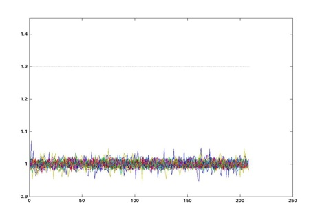
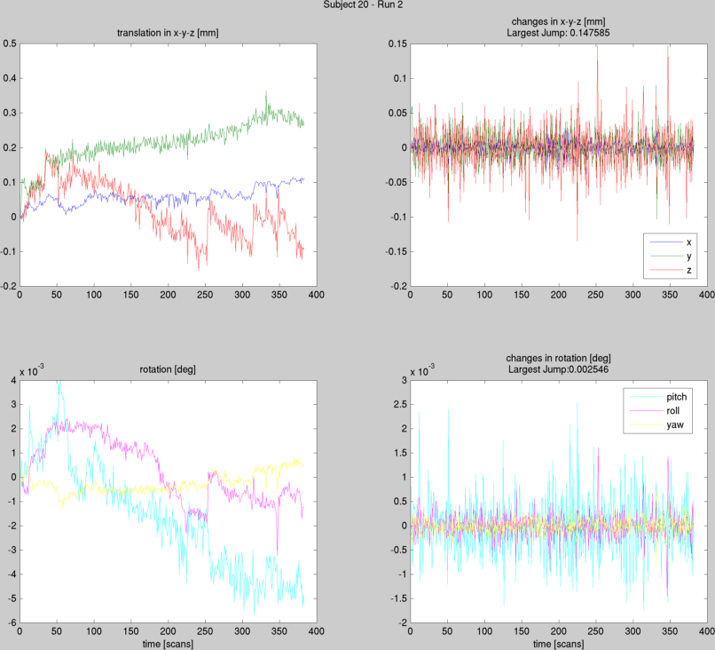
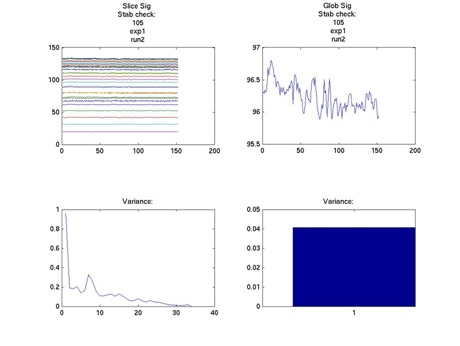
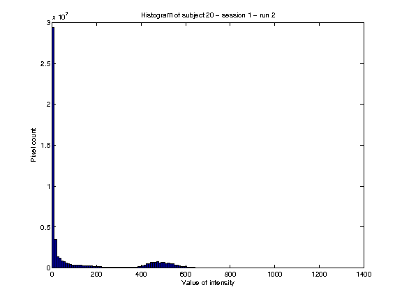
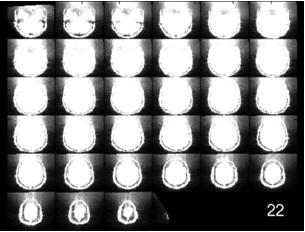
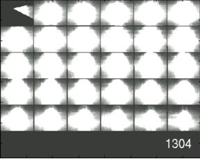
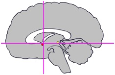

# Data Quality Checks - Overview #

This page describes which basic data quality checks are already part of the preprocessing pipeline and what to do with their output. Some checks are automatically performed at the appropriate step during preprocessing (e.g. spike detection before combining echoes). Some additional scripts need to be run on a windows machine (in contrast to the rest of the pipeline scripts), so they cannot be executed automagically.

A good part of checking the data quality is based on the researcher visually inspecting the data. The data checks deal with intensity (should be stable), and spikes (sudden peaks in intensity in one slice, one volume). 

## Spike detection ##

Spike detection is performed automagically before combining the multi-echo data. The following procedure is used:

For each slice, we pick the four corners and calculate the mean intensity for those voxels. Since those voxels are almost 100% surely outside the brain, they contain only noise. Spikes create ["wave like"](http://practicalfmri.blogspot.nl/2012/05/rare-intermittent-epi-artifacts-spiking.html) patterns (spikes in specific k-line), so they would make this intensity much larger for specific volumes. Thus, we simply look whether the intensity suddenly increased above a certain threshold. If yes, we "detected a spike".

To visually check this procedure, the timeseries are plotted (e.g. `sliceAverages_run1_echo2.png`) for each echo, with a line indicating the threshold:

x-axis: time (volume number); y-axis: standardized intensity of corners of slice; each line corresponds to one slice.

If any of the colored lines pass the threshold, a spike has occurred. This should not happen often, certainly not more than once during the same scan session. If you see multiple spikes for one participant, or if you see spikes for a couple of participants in a row, contact Paul. This is to check the scanner and avoid that future datasets will have many spikes. 

When visually inspecting these images, you want to check that all the images that cross the threshold are actually reflected in the log, and that the associated nifti file is copied into the `data_quality_checks` folder of that subject (to allow you to verify that it's a spike and to decide what you want to do about it - see below).

For now, **spikes are not removed**. This is because multi-echo data actually allows novel ways of removing spikes. For example, you could decide that you want to ignore a specific echo, and calculate the combined image only on the other, unaffected echoes. Alternatively, you could do the usual interpolation on adjacent timepoints within the same echo, or even a mixture of the two. 

Hint: Instead of averaging the adjacent volumes, you can simple add an additional regressor for each bad volume. Each of these regressors is all 0s except for the 1 bad volume that the regressor is modeling. This will eliminate the influence of the bad point entirely from the GLM.
It doesn't solve the issue of filtering or how bad volumes would influence the filtering process outside of the GLM.
[Donald McLaren]

## Movement parameters ##

This check is performed after combining, during which the movement parameters were estimated as part of realigning the images.

This step plots the movement parameters (e.g. `MovementParameters_run1.png`) estimated during the realignment of the functional images.
You are looking for large movements either in translation or rotation. 

What you should look for is large movement - several milimeters, *from one volume to another*. As a rule of thumb: if translation exceeds one voxel size (i.e. 3.5 mm), you should consider taking the necessary precautions. 

These precautions can include the following:

1. Removing the subject entirely (very drastic, often not absolutely necessary)
2. Using movement regressors (these can include the usual 6 regressors in the GLM at the first level, or even more (e.g. taking the squared movement) (see hint below)
3. 'Tagging' bad volumes or timepoints (using dummy regressors in the GLM) (see hint below)

In general, a slow movement which results in a large displacement over the whole run (say one hour) is not as bad as sudden, large movements. This is because, in principle, the slow movements will be picked up by your nuisance regressors. However,  for very large sudden movements, you might have the problem that realignment didn't work properly.

Hint: There are several ways of dealing with excessive head moevement and all have some drawbacks. My current recommendation is to add regressors to the GLM for each of these points that you consider a motion spike. I would also remove the time point after as well. Some researchers would advise removing the prior time point, the spike, and the ubsequent 2 points. For large motions of 2mm, this would probably be the approach I would use. To remove multiple points, add a separate regressor for each bad point. Each regressor will be all 0s except for the point you want to remove. 
[Donald McLaren]

## Mean Signal plots ##

This check is performed on the combined, but otherwise not-preprocessed iamges.

The output of this step are two plots, one with four graphs (e.g. `SignalCheck_020_001_run1.png`). For an example:

The upper left graph shows the mean intensity per volume, per slice. Volume number is on the x-axis, intensity on the y-axis, and every colored line is a different slice. The upper right graph shows the global signal, which is the mean intensity per image. Basically, it is the mean of the lines in the upper left graph. It is also the same as the mean curve that you can see on the scan computer during scanning. The lower panel depicts the variance of the two upper graphs.  

Especially important is the upper right plot, depicting the mean signal intensity. What you are looking for is whether there are unusual changes in the signal intensity (there shouldn't be any), and especially whether the global mean signal stays roughly stable (it should). Absolute numbers are not important in this plot. The average signal intensity can change by a couple of percent without this being of consequence to the quality of your data. Changes from 115 to 105 are fine, changes from 115 to 50 are not.  

The second plot is a histogram of signal intensities (e.g. `Histogram_020_001_run2.png`): 

This plot shows the distribution of signal intensities. You want it to have two "bumps" like in the plot above: one close to zero, coming from noise, and another one at much higher values (around 500 in the above image), combing from the brain. 

## Mosaic Movies ##

**You have to run this manually**, using `2_data_quality_checks/CreateMosaicMovies.m` (or `batch_CreateMosaicMovies.m`).

For this we create videos which show all slices in a "mosaic", mimicking the inline display on the host PC while scanning. 

The script produces two movies per run, a default movie and a contrast movie. The movies show one volume per scan pulse, in the same way as you see your volumes coming in on the Inline display during scanning. The number in the lower right corner corresponds to the number of images on the print list. If the movie produced is too light or too dark, you can adjust the brightness by editing the `configMovie.clims` settings in `2_data_quality_checks/CreateMosaicMovies.m`. In some of the movies, the corners get cut off from the first or last slice of the volume, or the skull can show up in black. This is no problem. 

The default movie shows your actual images, whereas the contrast movie aims at plotting the low intensity noise while overexposing the part of the image you’re actually interested in. The script also produces a histogram, showing you the distribution of intensities of your images. Intensities close to zero are noise, and the cluster further to the right is your actual image. Noise and image intensities should be distinct clusters. 

For an example of how the contrast movie should look like, check the following image:

For an example of a contrast movie that does not look fine, check the following image:

This image shows a still from a contrast movie just before the coil broke down. Data from this participant had to be excluded due to excessive noise in the data. The contrast is lower, and there is a lot of radiation in the horizontal direction.

### How To ###
 
On a windows PC (at the DCCN - to have access to your M-drive), navigate to `analysis_mri/2_data_quality_checks` and run `CreateMosaicMovies()` using Matlab2014a or newer.

## Check Normalization ##

**You have to run this manually**, using `2_data_quality_checks/Check_normalization_batch_script.R`. 

Checking normalization can be done in MRIcron. Here, you can overlay the structural image of a participant on the MNI template. 

You can automatize the creation of the overlay images using an `R` script: open `2_data_quality_checks/Check_normalization_batch_script.R` and follow the instructions inside the script.
 
If normalization seems to have gone wrong, click the Display button in SPM, and select the structural .nii image starting with s. Place the crosshair in the anterior commissure (see the picture below).  

Under crosshair position, look at the position in mm. Multiply these numbers with -1, and enter them for the right, forward and up positions. Click Reorient images to save the new home position of the crosshair for the ^s structural image AND all the slice-timed functional images (^a). After saving, set the crosshair position to 0 0 0 to check the position. Now, redo segmentation, normalization and smoothing for this participant. 

