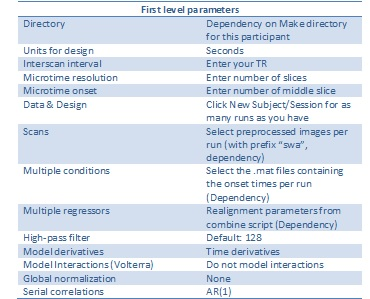

# Guidelines for 1st level analyses

In the first-level analysis in SPM, 3 types of input have to be recorded: onset times, preprocessed images and realignment parameters. 

## Setting up the first level in SPM

When running the first level analysis, a design matrix is produced for every participant. SPM let's you specify two types of regressors. First, regressors which you specify using onsets, durations. These will get convolved with the HRF. A typical example are events in your experiment (screens, participant's actions, like decisions or button presses). Second, regressors which won't get convolved. A typical example are motion regressors based on the realignment parameters (obtained during realignment). 

To make your life easy, you should use the `onsets.mat` and `rp_...txt` files to specify your conditions and regressors respectively. If you use this approach for all first level models, you won't have to change the SPM batch script, because you can simply swap out the `onsets.mat` for another one, containing other sets of events.

### Defining events ### 
Before you start working on the first-level analysis in SPM, you have to have the onset times per event in a `.mat` file, in a specific order. There should be one .mat file per run, per subject (24 subjects x 2 runs would amount to 48 .mat files).

If you programmed your task in Presentation or Matlab:
-It is then useful to code this as part of the task, so that onset times will be written to a .mat file at the time of data collection.

If you programmed your task in E-prime:
-In this case, there is an Eprime2SPM matlab script available that extracts the onset times from E-prime output and produces the right .mat files.

#### Durations #### 

In addition to specifying when events happened during the scanning session, you also have to specify what the duration of the evens was. Importantly, a duration of `0` is scaled differently by SPM than a duration of `0.001`. This makes the two not easily comparable! Check the SPM mailing list for details. Note that durations 

Warning: "I would model the onset of the wm as 0 seconds as well since that is when it begins. The duration should be 5s.
For the duration of the electrical stimulus, modeling it as 0 is fine for any task analysis as long as your not comparing s1/s2 to wm. If you plan on comparing s1/s2 to wm, then you will want to specify a non-zero duration to make sure the events are scaled correctly. If you plan on doing a PPI analysis, then you will want to specify duration as the PPI only looks at the first 1/16th of TR by default with 0s duration stimuli." [SPM mailing list]

Note: "If you plan on doing any task-dependent connectivity, you should model the actual duration of the trials as duration as a much larger impact on connectivity than on activity." [SPM mailing list](https://www.jiscmail.ac.uk/cgi-bin/webadmin?A2=ind1508&L=SPM&D=0&P=350168)

### Realignment parameters ###
For the first level analysis, we use the realignment parameter .txt files derived from the combine script. 
However, it is important to notice that these files contain 30 extra observations that have to be removed before you enter them as multiple regressors in the first level batch. 

## Microtime resolution and onset ## 

From the SPM mailing list ([beginning of full conversation](https://www.jiscmail.ac.uk/cgi-bin/webadmin?A2=ind1508&L=SPM&D=0&P=306973)): 

The microtime resolution is actually unrelated to the no. of slices acquired. Slices are acquired at discrete time points, and these differ between slices. However, even if we just have data from discrete time points we can predict the BOLD response e.g. based on the temporal resolution of the logfile, e.g. stimulus onset functions with a microtime resolution of 1 ms. A lower microtime resolution means that the predicted value for a certain discrete time point will be less accurate (because durations are rounded to the nearest time bin), and a higher microtime resolution will increase accuracy. Even if we acquired data e.g. every 10 s we could go with a microtime resolution of 1 ms and try to test for effects of different durations (100 ms vs. 101 ms).

In practice, this is unnecessary most of the time though, e.g. because you have constant durations all the time (but it's nonetheless not a bad idea to adjust the microtime resolution). We can come up with super-precise predictors, but what do they reflect? Does it make sense at all to assume constant "on" periods? Does the neural process really start at stimulus onset, does it end when the response is recorded? This is
1) why event-related designs often just go with 0 s (resulting in a duration = repetition time / microtime resolution), because for short durations, a different duration mainly affects the scaling of the predictor but not the temporal pattern. It becomes critical if you want to go with different durations for different conditions. Do you want the predictors to take into account different durations / reaction times? This is going to depend on your hypotheses then.
2) some people go with a microtime resolution reflecting the no. of slices because this way, it's very easy to specify the microtime onset. If you have acquired 17 slices and want the temporally 2nd to correspond to the microtime onset just go with 2 and 17.

If we use slice timing then the microtime onset should reflect the acquisition time of the reference slice. In that case the onsets don't have to be modified. If the reference slice is the temporally first slice then the microtime onset is 1, if it's the temporally middle the microtime onset is (microtime resolution)/2, for example 16/2 = 8. If you use any other slice as a reference you have to determine the most appropriate microtime onset yourself = (acquisition time of the slice)/TR microtime resolution. For example with an ascending interleaved scheme 2 4 6 ... 30 1 3 5 ... 29 the spatially middle slice is 15 due to the 30 slices overall, and it is acquired at the beginning of the third quarter of the TR, resulting in a microtime onset of 3/4 16 = 12.

In principle you could also use slice timing (working on the acquired data, e.g. onto the temporally middle slice), set the microtime onset to 1 (the predictor would then be "too early") and adjust the onsets (e.g. minus TR/2). But it's much more likely to introduce errors this way as you might accidentally correct the onsets into the wrong direction.

If you don't use any slice timing at all then a microtime onset of 8 (or microtime resolution/2) should be the best, as all the data has been acquired "somewhen during the TR". I think this was not the case in SPM5 at least, as far as I remember the default value was still 1 there.

### Suggested settings ###

See the image below for the first level parameters:

Note:
"(...) you should be aware that moving files around is only ok for preprocessing. Since SPM stores full paths to data files in its statistics data  ile SPM.mat, moved files will be a problem for e.g. plotting time courses in statistical analysis." 
Be aware that the same applies for the second level analyses.