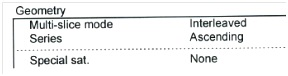

# Slice timing # 

## Background ## 

Every recorded volume of the brain consists of a number of slices which are collected at slightly different time points. Slice timing corrects for these differences in time of acquisition. All images are aligned to the time of acquisition of a reference slice, usually the middle slice. 

Note: The choice of the reference slice affects which microtime onset you should use in your [first-level level](doc_guidelines_for_1st_level.md)

Although the scan parameter list mentions that multi-slice mode is interleaved, slice order cannot be interleaved when using a multiecho sequence. Instead, look at the line below (Series), where it says whether scans were acquired in ascending or descending order. This is due to the sequence itself not being able to scan interleaved when in "multi-echo mode". If you are still doubting, ask Paul :)

If uncertain, check with Paul for your specific sequence.

Slice timing correction is not necessary if you have a block design. For more information on slice timing correction: http://mindhive.mit.edu/node/109 and the SPM manuals. 

## How To ##

First follow the preparation steps in the [Getting Started guide](howto_getting_started.md).

This is step is performed by the SPM batch `spmbatch_preprocessing.m`, which you call using `PreprocessSubject()`.
