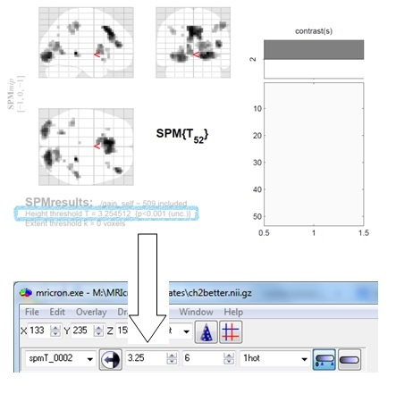
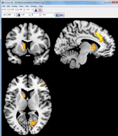

# Tips for Data Visualization #

## MRIcron ##

MRIcron can be used to visualize the data. 

In MRIcron, open a template brain, for example ch2better.nii.gz (File -> Open template).

To add your results from the second level:
-click Overlay -> Add
-select the spmT file of the contrast that you want to visualize (eg. spmT_0001.hdr)

This will result in an extremely colorful brain. To normalize this, change the thresholds on the second line (next to the spmT file you selected). The lower limit for the threshold can be found in the SPM results for the second level (see below). As upper limit for the threshold, choose a value that is higher than the lower limit, for example 6. 

Look up the T-threshold in the SPM results window, and enter this number in MRIcron. See the image below for an example:

For nice pictures, click the Color range from zero-button and remove the crosshair by clicking the Crosshair button. To display the color range of the overlay, click the Draw color range button. It is possible to add multiple overlays, and give each of them a different color. MNI coordinates can be used to navigate the brain: go to View -> MNI Coordinates. You can save your image as a bitmap. 
For an example of how brain pictures in MRIcron look like, check the image below:

MRIcron can also be used to look up the name of brain areas. To do this:
-open MRIcron a second time, and align the two screens next to each other.
-in the second screen, open the aal.nii.gz template.
-make sure the two windows are yoked (connected) by clicking View -> Yoke. 

In the lower left corner of the right window, you will see MNI coordinates and the name of the brain area where the crosshair currently is. For an example, check the image below:

![]](images/MRIcron_brain_map.jpg "[MRIcron Brain Map")